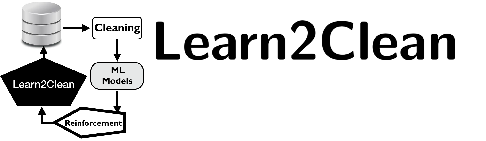
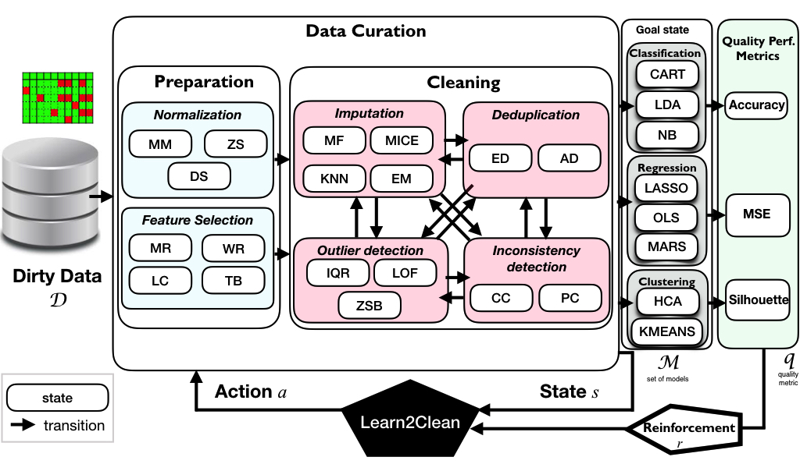

.. Learn2Clean documentation master file, created by sphinx-quickstart on Sat Mar 30 13:58:27 2019.

Welcome to Learn2Clean's documentation
=======================================

**Learn2Clean: The Python library for optimizing data preprocessing and cleaning pipelines based on Q-Learning** 

Learn2Clean is a Python library for data preprocessing and cleaning based on Q-Learning, a model-free reinforcement learning technique. It selects, for a given dataset, a ML model, and a quality performance metric, the optimal sequence of tasks for preperaring the data such that the quality of the ML model result is maximized.

In Learn2CLean, various types of representative preprocessing techniques can be used for:

* **Normalization**.  Min-Max (MM), Z-score (ZS), and decimal scale normalization (DS);

* **Feature selection**. based on a user-defined acceptable ratio of missing values (MR), removing collinear features (LC), using a wrapper subset evaluator (WR), and a model-based classifier for feature selection (Tree-Based or SVC);

* **Imputation**. Expectation-Maximization (EM), K-Nearest Neighbours, Multiple Imputation by Chained Equations (MICE), and replacement by the most frequent value (MF);

* **Outlier detection**. Inter Quartile Range (IQR), the Z-score-based method (ZSB), Local Outlier Factor (LOF);

* **Deduplication**. Exact duplicate (ED) and approximate duplicate (AD) detection based on Jaccard similarity distance;

* **Consistency checking**. Two methods based on constraint discovery and checking (CC) and pattern checking (PC).

-------------------

Links
~~~~~

* **Tutorial:** 
   * Laure Berti-Equille. ML to Data Management: A Round Trip. Tutorial Part I, ICDE 2018. `Tutorial <https://github.com/LaureBerti/Learn2Clean/tree/master/docs/publications/tutorial_ICDE2018.pdf>`__ 

* **Article:**
   * Laure Berti-Equille. Learn2Clean: Optimizing the Sequence of Tasks for Web Data Preparation. Proceedings of the Web Conf 2019, San Francisco, May 2019. `Preprint <https://github.com/LaureBerti/Learn2Clean/tree/master/docs/publications/theWebConf2019-preprint.pdf>`_

.. toctree::
   :maxdepth: 1
   :caption: Tutorial
   :hidden:

   installation
   introduction

.. toctree::
   :maxdepth: 3
   :caption: Features
   :hidden:
   
   features
   
.. toctree::
   :maxdepth: 1
   :caption: Contribution
   :hidden:
   
   authors
   contributing