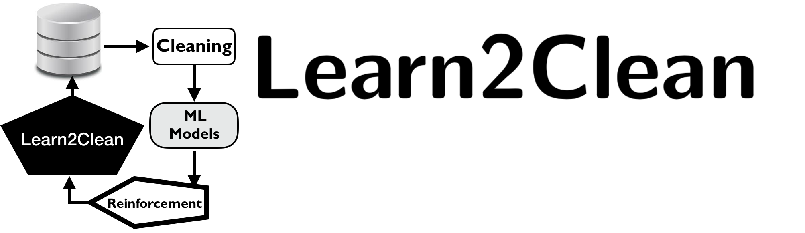

-----------------------

**Learn2Clean: Optimizing the Sequence of Tasks for Data Preparation and Data Cleaning**

|Documentation Status| |PyPI version| |Build Status| |GitHub Issues| |codecov| |License|

-----------------------

Learn2Clean is a Python library for data preprocessing and cleaning based on Q-Learning, a model-free reinforcement learning technique. It selects, for a given dataset, a ML model, and a quality performance metric, the optimal sequence of tasks for preparing the data such that the quality of the ML model result is maximized. 
 
You can try it for composing your own data preprocessing pipelines or for automizing data preparation before clustering, regression, and classification.

.. image:: ./docs/images/figure_Learn2Clean.jpeg

**For more details**, please refer to the paper presented at the Web Conf 2019 and the related tutorial.

- Laure Berti-Equille. Learn2Clean: Optimizing the Sequence of Tasks for Web Data Preparation. Proceedings of the Web Conf 2019, San Francisco, May 2019. `Preprint <https://github.com/LaureBerti/Learn2Clean/tree/master/docs/publications/theWebConf2019-preprint.pdf>`__ 

- Laure Berti-Equille. ML to Data Management: A Round Trip. Tutorial Part I, ICDE 2018. `Tutorial <https://github.com/LaureBerti/Learn2Clean/tree/master/docs/publications/tutorial_ICDE2018.pdf>`__ 

--------------------------

How to Contribute
=================

Learn2Clean is a research prototype. Your help is very valuable to make it better for everyone.

- Check out `call for contributions <https://github.com/LaureBerti/Learn2Clean/labels/call-for-contributions>`__ to see what can be improved, or open an issue if you want something.
- Contribute to the `tests <https://github.com/LaureBerti/Learn2Clean/tree/master/tests>`__ to make it more reliable. 
- Contribute to the `documents <https://github.com/LaureBerti/Learn2Clean/tree/master/docs>`__ to make it clearer for everyone.
- Contribute to the `examples <https://github.com/LaureBerti/Learn2Clean/tree/master/examples>`__ to share your experience with other users.
- Open `issue <https://github.com/LaureBerti/Learn2Clean/issues>`__ if you met problems during development.

For more details, please refer to `CONTRIBUTING <https://github.com/LaureBerti/Learn2Clean/blob/master/docs/contributing.rst>`__.

.. |Documentation Status| image:: https://readthedocs.org/projects/learn2clean/badge/?version=latest
   :target: https://learn2clean.readthedocs.io/en/latest/
.. |PyPI version| image:: https://badge.fury.io/py/learn2clean.svg
   :target: https://pypi.python.org/pypi/learn2clean
.. |Build Status| image:: https://travis-ci.org/LaureBerti/Learn2Clean.svg?branch=master
   :target: https://travis-ci.org/LaureBerti/Learn2Clean
.. |GitHub Issues| image:: https://img.shields.io/github/issues/LaureBerti/Learn2Clean.svg
   :target: https://github.com/LaureBerti/Learn2Clean/issues
.. |codecov| image:: https://codecov.io/gh/LaureBerti/Learn2Clean/branch/master/graph/badge.svg
   :target: https://codecov.io/gh/LaureBerti/Learn2Clean
.. |License| image:: https://img.shields.io/badge/License-BSD%203--Clause-blue.svg
   :target: https://github.com/LaureBerti/Learn2Clean/blob/master/LICENSE
   

--------------------------

Licence 
=================

Learn2Clean is licensed under the BSD 3-Clause "New" or "Revised" License.

